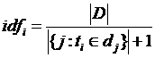

# Content-based Recommendation
### 步骤

1、Item Representation（Content Analyzer），抽取特征表达item。
    
    对于物品特征属性的抽取主要包括对数值型数据、非数值型数据的处理，主要处理方法：
        数值型归一化、数值型二值化、非数值型数据词袋法转化为特征向量、TF-IDF、Word2Vec
2、Profile Learning（profile learner）， 利用用户过去喜欢（不喜欢）的item的特征数据，学习用户profile。
    
    常用算法：K-nearest Neighbor KNN、Decision tree DT、Linear Classifier LC、Naive Bayes NB
3、 Recommendation Generation（Filtering Component），比较profile与候选item特征，选择相关性最大的一组item。

  
### 优缺点
优点： 没有冷启动问题，不需要太多的用户评分。

缺点：很难在内容特征中提取用户偏好级别的内容相似性，无法为新用户产生推荐。

### 关于TF-IDF
信息检索(Information Retrieval)是查找信息的方法和手段。
为了解决信息检索问题，人们在20世纪70年代就开始尝试把查询关键字(Query)和文档(Document)都转换成”向量”，
在文档集合上，对于关键词1……n组成的查询串q，返回一个按查询q和文档d匹配度relevance(q, d)排序的相关文档列表。
信息检索涉及到自然语言处理的内容，
这其中首要的也是基础的工作是文本数字化技术：
将一行文本转换为一个向量。其中一种典型的技术就是TF-IDF模型。
它可以用作抽取关键字、文本分类任务、表示一个句子的特征。
首先为了帮助了解TF-IDF技术的出发点，需理解以下内容。
直觉上来说，如果某个词语在文本中重复出现了多次，那么这个词语在这个文本中的重要性就会显著增加，更有可能是关键字。
然而，仔细考虑，对于”的”、”是”、”在”、”is”等常见的”停用词”(stop words)在文本中出现次数往往最多，但它们不可能是查询关键字，
因此如果只关注重复出现次数，那么结果必然是一些常用词的权重很大，但某些常用词对查询并无帮助。
相反，如果某个词比较少见，但它在文本中多次出现则更可能是文本的关键词。
从统计学角度，除了要关注重复出现的词外，还需要给予不常见词较大的权重，以减少常见词的权重。
TF-IDF(term frequency-inverse document frequency)就是一种用于信息检索与数据挖掘的常用加权技术。
其中词频TF(Term Frequency)表示某个词在文章中出现的频率，而逆文档频率(Inverse Document Frequency)反映关键词的普遍程度,关键词在文档中的TF-IDF值为TF乘IDF。
关于TF-IDF原始定义如下：
   

    
             
                   
其中，词ti在文件dj中出现的次数为ni,j，文件dj中所有字词的出现次数之和为Σk nk,j，|D|为语料库中的文件总数，|{j:ti∈dj}|为包含词的文件数目。对TF-IDF的变形或改进一般会对其tf/idf/正则化计算方法进行修改，以适应不同的任务。
可以看到，TF-IDF倾向于过滤掉常见的词语，保留重要的词语。
TF-IDF的优点是实现简单，容易理解，但其提取关键字的缺点也十分明显，IDF的简单结构并不能使提取的关键词十分有效地反映单词的重要程度和特征词的分布情况，同时严重依赖语料库，需要选取质量较高且和所处理文本相符的语料库进行训练。
例如，在一个原本就主要由教育类文章构成的语料库，一篇属于教育类的文章中与教育相关的词语的IDF值将会偏小，使其被确认为文本关键词的可能性变小，使得这样的关键词被遗漏。
TF-IDF还有一个缺点就是不能反映词的位置信息与语义关系。
在对关键词进行提取的时候，根据词的位置信息应该给予不同的权重，并且语义上相近的词应该具备相似的重要程度。
为了解决以上所说的第一个缺点，提出了TF-IWF(Term Frequency-Inverse Word Frequency)，它在TF-IDF的基础上，修改IDF部分为IWF，定义IWF为：，分子表示语料库中所有词语的频数之和，分母表示词在语料库中的总频数。这种加权方法降低了语料库中同类型文本对词语权重的影响，更加精确地表达了这个词语在待查文档中的重要程度。
对于第二个缺点，由于TF-IDF这一类**向量空间模型**，将词编码为唯一不同的数字，单纯的将两个词绝对的表示，没有考虑词与词之间的语义关系。但实际上，词与词之间存在语义关系，语义相近的词在编码上应该也相似。
为了解决这一问题，提出了文本分布式表示，又称embedding技术，这种技术可以将一个词表示为一个低维、稠密的向量，使语义上相近的词的词向量也相近，目前embedding技术日趋成熟，相关技术包括Word2vec、Item2vec、DeepWalk、Node2vec、EGES、局部敏感哈希等方法。
总的来说，TF-IDF是一种统计方法，用以评估一字词对于一个文件集或一个语料集中的其中一份文件的重要程度。字词的重要性随着它在文件中出现的次数成正比增加，但同时会随着它在语料库中出现的频率成反比下降。TF-IDF加权的各种形式常被搜索引擎应用，作为文件与用户查询之间相关程度的度量或评级。
### 关于分词

NLP底层任务：词法分析（词性识别、命名实体识别）、句法分析、语义分析

分词是词法分析中最基本的任务

分词算法：
   
1、基于词典的分词

    1.1、最大匹配分词算法(MM)
    基本思想：
        有一待处理字符串str1，假设已有词典中的最长词条字符长度为a，取被处理字符串（str1），从中截取出a长度的字符串记做str2，将str2与词典中词条一一匹配，如果词典中有str2,那么str2从str1中切分出来，作为一个词。
        如果词典中没有str2,那么从str1中截取a-1长度的字符串记做str3,还是进行上面的匹配步骤，如果str3在词典中，str3作为一个词，反之，继续缩短字符串长度。
        直到切分成功为止。即完成一轮匹配，并切出一词。**不好使**
    1.2、最短路径分词算法
        只有一条最短路径时，Dijkstra最短路径可以满足部分分词要求
        多条距离相同最短路径时，N-最短路径分词算法（Dijkstra最短路径扩展）
    1.3、基于n-gram model的分词算法
        现实中词图边权重不同，求解最短路径转换为求解最大概率路径，这是仅有词典不够，还需要有充足的语料。
2、基于字的分词

    把字标记为B(Begin)I(Inside)O(Outside)E(End)S(Single)，转换成了分类问题->序列标注，可以用机器学习或者神经网络方式求解。
    生成式模型：以“输出Y按照一定的规律生成输出X”为假设对P(X,Y)联合概率建模
        n-gram、HMM、朴素贝叶斯，前两者使用较多
    判别式模型：Y由X决定，直接对后验概率P(Y|X)建模
        感知机、SVM支持向量机、CRF条件随机场、最大熵模型，常用的为1、3.
    神经网络分词法：RNN卷积神经网络、LSTM（RNN变种之一），目前对于序列标记任务，公认效果最好的式BiLSTM + CRF
分词考虑的数据结构：1、词典怎么存 2、词图怎么存

中文分词系统：ICTCLASS（java）、jieba(python)、HanNLP（java）
            

###**参考文献**

    基于内容的推荐，https://www.cnblogs.com/breezedeus/archive/2012/04/10/2440488.html
    TFIDF之python实现，https://www.cnblogs.com/wang2825/articles/8974494.html
    NLP分词算法深度综述, https://zhuanlan.zhihu.com/p/50444885
    简单的中文分词算法, https://zhuanlan.zhihu.com/p/26878448